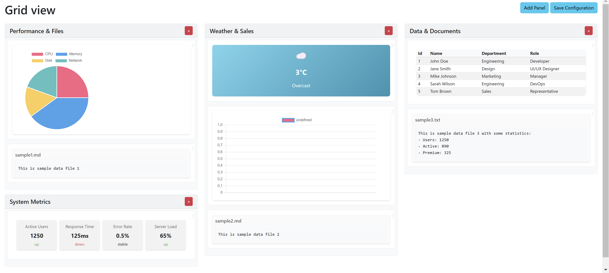

# AI sample project

Made with Claude AI via Windsurf IDE by prompting the AI for 1-2 hours only, no manual work.

This view can show the contents of a file system folder in a grid view with multiple columns that feature sub groups.

I will continue this in a private copy as part of a advanced information management application.

LICENSE
----------------------------------------------------------

Copyright (C) Walter A. Jablonowski 2024, free for non-commercial users currently under AGPLv3 [MIT license](LICENSE).

This app is build upon PHP and free software (see [credits](credits.md))

[Privacy](https://walter-a-jablonowski.github.io/privacy.html) | [Legal](https://walter-a-jablonowski.github.io/imprint.html)
